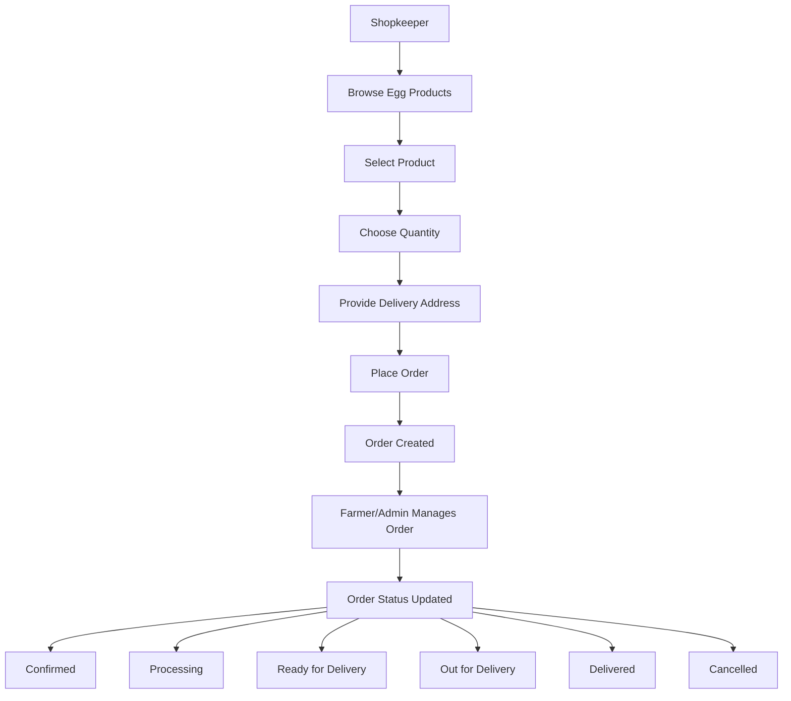
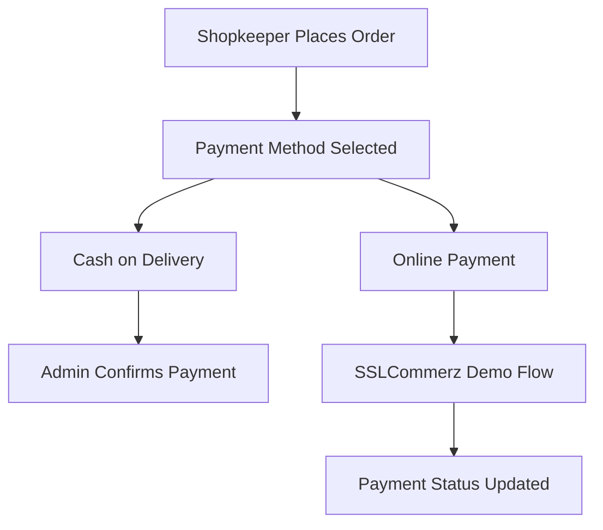

# Farm2Shop - Direct Farmer-to-Shopkeeper Egg Supply Platform

## 🌐 Live Demo

- **User Website:** https://farm2shop.netlify.app
- **Admin Dashboard:** https://farm2shopadmin.netlify.app

**Farm2Shop** is a full-stack egg supply management platform that directly connects farmers with shopkeepers. Farmers can publish egg products, while shopkeepers can browse products and place orders. The platform also includes a dedicated admin dashboard for managing users, products, orders, categories, verification, and platform earnings.

The system provides separate interfaces for **Farmers, Shopkeepers, and Admins**, with role-based authentication and functionality designed for each user type.

Farm2Shop is built using the **MERN stack**, along with Cloudinary for image storage and SSLCommerz for demo payment integration.

---

## 💪 Motivation

I have recently discovered that there is no such platform available in Bangladesh which is dedicated to connect the egg farmers and shopkeepers directly. This may seem normal because most of the egg farms of our country rely on traditional egg supply chan.
The traditional egg supply chain is something like:
 
Farmer → Local Dealer → Large City Dealer → Sub-Dealer → Van Supplier → Shopkeeper → Consumer

This traditional egg supply chain has definately some issues. Dependency on this multiple levels increase the price of the egg significantly. And besides, this can create syndicate on this egg supply chain.
The main idea behind this project was simple: make the process of selling, buying, and managing egg products more organized and convenient through a digital platform.

The impact of our platform can help to benifit both the farmers, shopkeepers and the general consumers too.

For example, In the current egg supply chain, If the market rate of a particular category of egg is 12.5 BDT. per egg, then,
- Farmers usually sell it on about 9.00 BDT. per egg
- The multiple intermediary levels consume about 3.00 tk. per egg, making it 12.00 BDT. per egg
- The shopkeepers buy it on 12.00 BDT
- And finally the consumers buy it on 12.5 BDT

But In case of our platform, the situation will be something like:
- Farmers will sell it on 10.30 BDT
- Platform cost 1.00 BDT, making it 11.50 BDT
- The shopkeepers will buy it on 11.50 and sell it on 12.50

---

## 🛠️ Tech Stack

- **Frontend:** React.js, Tailwind CSS
- **Frontend Development Tool:** Vite
- **Backend:** Node.js, Express.js
- **Database:** MongoDB
- **ODM:** Mongoose
- **Authentication:** JSON Web Token (JWT)
- **Password Security:** bcrypt
- **API:** RESTful APIs
- **HTTP Client:** Axios
- **Image Storage:** Cloudinary
- **File Upload:** Multer
- **Notifications:** React Toastify
- **Icons:** React Icons
- **Payment Gateway:** SSLCommerz
- **Backend Deployment:** Render
- **Frontend Deployment:** Netlify,Vercel

---

## 🔑 Key Features

## 1. Three-Level Authentication

Farm2Shop provides separate authentication and functionality for three types of users:

### 👨‍🌾 Farmer

- Register securely.
- Log in using email and password.
- Upload a profile image.
- Manage personal profile information.
- Add and manage farm information.
- View farmer verification status.
- Add egg products.
- Upload product images.
- Set product quantity.
- Set minimum order quantity.
- Manage product availability.
- View orders related to their products.
- Receive order notifications.
- Receive payment notifications.
- Log out securely.

### 🏪 Shopkeeper

- Register securely.
- Log in using email and password.
- Upload a profile image.
- Manage shop information.
- Add shop name and shop address.
- Add shop description.
- View shopkeeper verification status.
- Browse available egg products.
- Search and view products.
- View detailed product information.
- Place orders from farmers.
- Select order quantity.
- Provide delivery address.
- View order details.
- Track order status.
- Use available payment methods.
- Receive order notifications.
- Receive payment notifications.
- Log out securely.

### 🛠️ Admin

- Secure admin authentication.
- View dashboard statistics.
- View total orders.
- View total farmers.
- View total shopkeepers.
- View total eggs sold.
- View platform earnings.
- View recent orders.
- Manage egg categories.
- Add new categories.
- Add and update category prices.
- Search categories.
- Sort categories by price.
- View all orders.
- Search orders by order ID.
- Filter orders by order status.
- Filter orders by payment status.
- View detailed order information.
- Update order status.
- Mark eligible Cash on Delivery payments as paid.
- View all farmers.
- Search farmers by name, email, NID, or farm name.
- Filter farmers by verification status.
- View farmer details.
- Approve or reject farmer verification.
- View all shopkeepers.
- Search shopkeepers by name, email, or NID.
- Filter shopkeepers by verification status.
- View shopkeeper details.
- Approve or reject shopkeeper verification.
- View platform earnings from completed orders.

---

## 🏠 Farmer and Shopkeeper Home Page

The shared frontend provides a user-friendly starting point for farmers and shopkeepers.

The platform includes:

- Easy navigation.
- Product browsing.
- Product search.
- Product category information.
- Product availability information.
- Navigation to registration and login pages.
- Access to user dashboards.
- Responsive design for different screen sizes.
- Separate features based on the logged-in user's role.

---

## 🥚 Product Management

Farmers can add and manage egg products through the platform.

A product can include:

- Product name.
- Product category.
- Product description.
- Product images.
- Available quantity.
- Minimum order quantity.
- Farmer information.
- Product availability status.
- Product expiration date.

Farmers can manage the products they publish, while shopkeepers can browse available products and view product details.

---

## 🛒 Product Browsing

Shopkeepers can browse egg products published by farmers.

Shopkeepers can:

- View available products.
- Search for products.
- View product names.
- View product images.
- View product descriptions.
- View product prices.
- View available quantities.
- View minimum order quantities.
- View farmer information.
- View product expiration dates.
- Open detailed product pages.
- Proceed to place an order.

---

## 📦 Order Management

Farm2Shop provides an order management system for shopkeepers, farmers, and administrators.

The order system stores information such as:

- Shopkeeper information.
- Farmer information.
- Product information.
- Product category.
- Order quantity.
- Unit price.
- Total amount.
- Delivery address.
- Order status.
- Payment method.
- Payment status.
- Order creation date.
- Order update date.

### Available Order Statuses

Orders can move through different stages:

- `placed`
- `confirmed`
- `processing`
- `ready_for_delivery`
- `out_for_delivery`
- `delivered`
- `cancelled`

Shopkeepers can track the progress of their orders, while farmers and administrators can manage order-related activities.

---

## 💳 Payment Integration

Farm2Shop includes SSLCommerz payment integration for testing and demonstration purposes.

The project supports payment-related information such as:

- Payment method.
- Payment status.
- Transaction ID.
- Validation ID.
- Successful payment handling.
- Failed payment handling.
- Cancelled payment handling.

The available payment methods include:

- Cash on Delivery
- Online Payment

> **Important:** The current project uses SSLCommerz for demo/testing purposes. No real-money transaction flow is intended in the current configuration.

---

## 🔔 Notification System

The platform provides notifications for important activities.

Notifications may be generated for:

- Order placement.
- Order status updates.
- Successful online payment.
- Payment received by farmers.
- Other important order-related events.

Notifications help farmers and shopkeepers stay informed about their activities.

---

## 👤 User Profile

Farmers and shopkeepers can manage their profile information after logging in.

### Farmer Profile

Farmers can manage:

- Name.
- Email.
- Phone number.
- NID.
- Profile image.
- Farm name.
- Farm address.
- Farm description.
- Verification status.

### Shopkeeper Profile

Shopkeepers can manage:

- Name.
- Email.
- Phone number.
- NID.
- Profile image.
- Shop name.
- Shop address.
- Shop description.
- Verification status.

Users can also:

- Update permitted profile information.
- Upload a new profile image.
- View their account information.
- Log out securely.

---

## 🗄️ Admin Panel

The admin panel is a separate React application used to manage the Farm2Shop platform.

The admin panel includes the following sections:

- Dashboard
- Categories
- Orders
- Shopkeepers
- Farmers
- Earnings

---

## 📊 Admin Dashboard

The admin dashboard displays important platform statistics, including:

- Total number of orders.
- Total number of farmers.
- Total number of shopkeepers.
- Total eggs sold.
- Total platform earnings.
- Recent orders.

## 💵 Platform Earnings
 
The platform earns a flat rate **per qualifying egg sold**.
 
| Metric | Value |
|---|---|
| Platform earning per egg | ৳1 |
| Total qualifying eggs sold | 1,000 |
| **Total platform earnings** | **৳1,000** |
 
> Earnings are calculated automatically based on qualifying completed orders — see [Admin Earnings](#-admin-earnings) for details.
 
---
 
## 🏷️ Category Management
 
Administrators can manage egg categories and their prices. Categories are used to organize products and manage pricing information.
 
**Admin category features:**
 
- ✅ View all categories
- ➕ Add a new category
- 💲 Set a category price
- 🔄 Update category prices
- 🔍 Search categories
- ↕️ Sort categories by price
- ℹ️ View category information
---
 
## 📋 Admin Order Management
 
Administrators can view and manage all platform orders.
 
**Order record includes:**
 
| Field | Description |
|---|---|
| Order ID | Unique order identifier |
| Shopkeeper name | Buyer of the order |
| Farmer name | Seller of the order |
| Product name | Egg product ordered |
| Category | Product category |
| Order quantity | Number of eggs/units |
| Unit price | Price per unit |
| Total amount | Total order value |
| Order status | Current fulfillment stage |
| Payment method | COD / Online |
| Payment status | Paid / Unpaid |
| Order date | Date order was placed |
 
**Admin capabilities:**
 
- 🔍 Search orders by order ID
- 🧰 Filter orders by order status
- 🧰 Filter orders by payment status
- 👁️ View order details
- 🔄 Update order status
- ✅ Mark eligible Cash on Delivery payments as paid
---
 
## 👨‍🌾 Farmer Management
 
Administrators can view and manage registered farmers.
 
**Farmer record includes:**
 
| Field | Description |
|---|---|
| Farmer name | Full name |
| Email | Contact email |
| Phone number | Contact number |
| NID | National ID |
| Farm name | Name of the farm |
| Farm address | Physical address |
| Verification status | Pending / Approved / Rejected |
| Account status | Active / Inactive |
| Registration date | Date joined the platform |
 
**Admin capabilities:**
 
- 👁️ View all farmers
- 🔍 Search farmers by name
- 🔍 Search farmers by email
- 🔍 Search farmers by NID
- 🔍 Search farmers by farm name
- 🧰 Filter farmers by verification status
- ℹ️ View farmer details
- ✅ Approve farmer accounts
- ❌ Reject farmer accounts
---
 
## 🏪 Shopkeeper Management
 
Administrators can view and manage registered shopkeepers.
 
**Shopkeeper record includes:**
 
| Field | Description |
|---|---|
| Shopkeeper name | Full name |
| Email | Contact email |
| Phone number | Contact number |
| NID | National ID |
| Shop name | Name of the shop |
| Shop address | Physical address |
| Verification status | Pending / Approved / Rejected |
| Account status | Active / Inactive |
| Registration date | Date joined the platform |
 
**Admin capabilities:**
 
- 👁️ View all shopkeepers
- 🔍 Search shopkeepers by name
- 🔍 Search shopkeepers by email
- 🔍 Search shopkeepers by NID
- 🧰 Filter shopkeepers by verification status
- ℹ️ View shopkeeper details
- 📦 View shopkeeper orders
- 🥚 View total eggs purchased
- ✅ Approve shopkeeper accounts
- ❌ Reject shopkeeper accounts
---
 
## 💰 Admin Earnings
 
The earnings section displays platform earnings from **qualifying completed orders only**.
 
> An order qualifies **only if both** conditions are met:
> - `orderStatus = delivered`
> - `paymentStatus = paid`
 
**The earnings section can display:**
 
- 🥚 Total eggs sold
- 💵 Total platform earnings
- 📦 Number of completed orders
- ✅ Completed order information
- 👨‍🌾 Farmer information
- 🏪 Shopkeeper information
- 📦 Product information
- 🔢 Order quantity
- 🏷️ Order category
> 💡 **Platform earning rate:** ৳1 per qualifying egg sold.
 
---
 
## 🔐 Authentication and Security
 
Farm2Shop uses several authentication and security mechanisms:
 
- 🔑 JWT-based authentication
- 👥 Separate authentication for farmers and shopkeepers
- 🛡️ Separate authentication for administrators
- 🍪 HTTP-only authentication cookies
- 🔒 Password hashing using bcrypt
- 🚧 Protected backend routes
- 🎭 Role-based authorization
- 🌱 Environment variables for sensitive information
- 🌐 CORS configuration
- 🖼️ Secure image upload handling
- 🔐 Protected admin endpoints
**Cookies used:**
 
| Cookie | Purpose |
|---|---|
| `token` | Farmer and shopkeeper authentication |
| `adminToken` | Admin authentication |
 
Authenticated frontend requests use:
 
```js
{
  withCredentials: true
}
```
 
> ⚠️ Never expose JWT secrets, database credentials, Cloudinary secrets, admin passwords, or SSLCommerz credentials in frontend code or public repositories.
 
---
 
## 🌐 Project Setup
 
Follow the steps below to run Farm2Shop locally.
 
### 1. Clone the Repository
 
```bash
git clone https://github.com/Kamrul-Naim/PulseCare-Medical-Appointment-Management-System.git
cd Farm2Shop
```
 
### 2. Install Backend Dependencies
 
```bash
cd backend
npm install
```
 
### 3. Install Frontend Dependencies
 
```bash
cd frontend
npm install
```
 
### 4. Install Admin Dependencies
 
```bash
cd admin
npm install
```
 
---
 
## ⚙️ Environment Variables
 
Create the required `.env` files according to the application structure.
 
### Backend Environment Variables
 
Create a `.env` file inside the `backend` directory:
 
```env
PORT=4000
NODE_ENV=development
 
MONGODB_URI=your_mongodb_connection_string
 
CLOUDINARY_NAME=your_cloudinary_name
CLOUDINARY_API_KEY=your_cloudinary_api_key
CLOUDINARY_SECRET_KEY=your_cloudinary_secret_key
 
JWT_SECRET=your_jwt_secret
ADMIN_JWT_SECRET=your_admin_jwt_secret
 
ADMIN_NAME=your_admin_name
ADMIN_EMAIL=your_admin_email
ADMIN_PASSWORD=your_admin_password
 
SSLCOMMERZ_STORE_ID=your_sslcommerz_store_id
SSLCOMMERZ_STORE_PASSWORD=your_sslcommerz_store_password
SSLCOMMERZ_IS_SANDBOX=true
 
BACKEND_URL=http://localhost:4000
FRONTEND_URL=http://localhost:5173
ADMIN_FRONTEND_URL=http://localhost:5174
```
 
### Shared Frontend Environment Variables
 
Create a `.env` file inside the `frontend` directory:
 
```env
VITE_BACKEND_URL=http://localhost:4000
```
 
### Admin Frontend Environment Variables
 
Create a `.env` file inside the `admin` directory:
 
```env
VITE_BACKEND_URL=http://localhost:4000
```
 
> ⚠️ **Important:** Never commit `.env` files or sensitive credentials to GitHub. Add `.env` files to `.gitignore`.
 
---
 
## 📦 Folder Structure
 
```
Farm2Shop/
│
├── frontend/
│   ├── public/
│   ├── src/
│   ├── package.json
│   └── ...
│
├── admin/
│   ├── public/
│   ├── src/
│   ├── package.json
│   └── ...
│
├── backend/
│   ├── config/
│   ├── controllers/
│   ├── middlewares/
│   ├── models/
│   ├── routes/
│   ├── services/
│   ├── utils/
│   ├── server.js
│   ├── package.json
│   └── ...
│
├── .gitignore
└── README.md
```
 
---
 
## 🔄 Order Workflow
 

 
---
 
## 💳 Payment Workflow
 
The payment workflow supports **Cash on Delivery** and an **online payment demonstration**.
 

 
---
 
## 🚀 Deployment
 
Farm2Shop is designed to use the following deployment architecture:
 
| Component | Platform |
|---|---|
| Shared Farmer/Shopkeeper Frontend | Vercel, Netlify |
| Admin Frontend | Vercel, Netlify |
| Backend | Render |
| Database | MongoDB Atlas |
| Image Storage | Cloudinary |
| Payment Integration | SSLCommerz |
 
---
 
## 🔒 Security Notes
 
- 🚫 Never commit `.env` files
- 🚫 Never expose passwords in frontend code
- 🚫 Never expose JWT secrets publicly
- 🚫 Never expose Cloudinary API secrets publicly
- 🚫 Never expose SSLCommerz credentials publicly
- 🔑 Use strong JWT secrets
- 🍪 Use secure cookies in production
- 🔐 Use HTTPS in production
- 🌐 Restrict CORS to trusted frontend domains
- ✅ Validate payment responses before updating payment status
- 🛡️ Protect admin routes with admin authentication
- 📝 Avoid logging tokens and passwords
- 📦 Keep dependencies updated
- 🔍 Review all production environment variables before deployment
---
 
## 🤝 Contributing
 
Contributions are welcome! To contribute:
 
1. 🍴 Fork the repository
2. 🌿 Create a new branch
3. ✍️ Make your changes
4. 🧪 Test your changes locally
5. 💾 Commit your changes
6. ⬆️ Push your branch to GitHub
7. 🔀 Open a Pull Request
---
 
## 📄 License
 
This project is currently intended for **educational, development, and demonstration purposes**.
 
---
 
## 🌟 Acknowledgements
 
This project was developed using:
 
React.js · Vite · Tailwind CSS · Node.js · Express.js · MongoDB · Mongoose · JWT · bcrypt · Axios · Cloudinary · SSLCommerz · Render · Vercel · Netlify
 
---
 
<div align="center">
**Farm2Shop — Connecting Farmers and Shopkeepers for a Better Egg Supply Chain.** 🥚
 
</div>
 